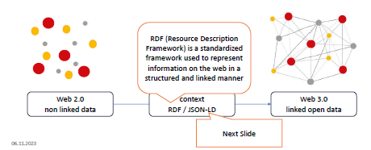
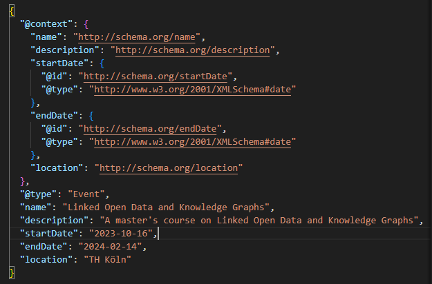

# JSON-LD
### JavaScript Object Notation for Linked Data

### How can we built a semantic web?

- semantic web = collection of
interrelated
datasets on the
Web 

### What is JSON-LD?
- JSON-based syntax
    - JSON based syntax
    - It allows structured and standardized data representation on
the web
- published in 2014
- develpoped by the W3C
- JSON
LD is a concrete RDF syntax
    - RDF provides a framework of grammar (Syntax)
- Using this grammar, RDF syntax can be written in various concrete
formats which are called RDF serialization formats e.g. JSON LD

**Important: RDF = data model (Framework) | JSON-LD = serialization format** 

- JSON-LD – makes JSON data compatible with the RDF framework
    - data is exchanged as simple JSON data, and a context record specifies how to convert
the JSON data to RDF

### Example of JSON-LD code

### Use Cases for JSON-LD
- Web API Application
- Browser based UI Application
- Archive / Retrieval with RDBMS
- List based data applications

### Embedding of JSON-LD in websites

- JSON
LD starts with:
    - `@context”: “https://schema.org/`
- The @type keyword specifies the
type you are referring to. In this
case, to an Recipe
    - `@type”: “Recipe`
- Embedding in the head or body of a
website possible

### Advantages vs. Disadvantages of JSON-LD

| Advantages | Disadvantages |
| ----------- | ----------- |
| Easy to use | more difficult for search engines to verify that the JSON-LD structured data is consistent with the visible human readable information |
| JSON-LD markup is decoupled from the human readable HTML markup appearing in the of the page -> there is much less risk of breaking or misconnecting the collection of RDF triples that can be extracted from the page |  |
|many companies already use JSON within their websites. Via the @context header of JSON LD the locally named properties can be mapped with the defined web vocabularies | |

### Examples why use stuctured data on websites?
- Rotten Tomatoes added structured data to
100,000 unique pages and measured a 25%
higher click through rate
- Rakuten has found that users spend 1.5x
more time on pages that implemented
structured data than on non structured data
pages

- **Google Search also uses structured data to enable special search results features and enhancements. For example, a recipe page with valid structured data is eligble to appear in a graphical search result**

### Summary
- JSON- LD with its advantages is the most
widely used format
    - Is preferred by google
- JSON-LD tries to stay as close as possible to
the usual use of JSON as a data exchange
format for web developers
    - Easy to implement for web developers
- Adding structured data can enable search
results that are more engaging to users and
might encourage them to interact more with
your website, which are called rich results
    - JSON-LD presents a solution to the problem of disorganized data on the web

### Sources
- https://en.wikipedia.org/wiki/Linked_data

- https://json-ld.org/

- https://www.w3.org/2013/dwbp/wiki/RDF_AND_JSON-LD_UseCases

- https://www.omt.de/suchmaschinenoptimierung/json-ld/

- https://developers.google.com/search/docs/appearance/structured-data/intro-structured-data?hl=de

- https://www.w3.org/TR/json-ld/#bib-RDF11-CONCEPTS