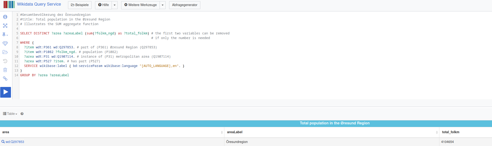
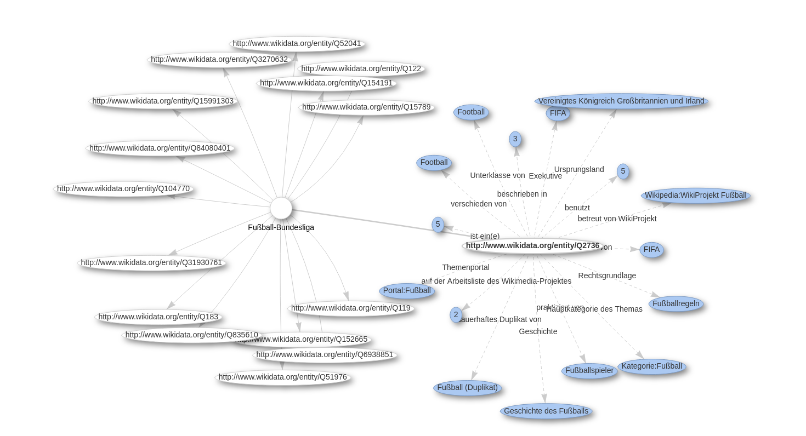

# Topic Name

2023-11-06, Finn Heydemann

## TOC

* Wikidata
* Data objects
* Development 
* Concept 
* Statements
* Prperties
* Query Service
* Query Service: Knowledge graphs

## Wikidata

- Collaboratively edited multilingual knowledge graph 

- Source of open data that anyone can use (e.g. Wikipedia)

- Wikidata is powered by MediaWiki, which stores the data, including its extension for semi-structured data, the Wikibase

  

## Data Objects

* Over 100 million data obejcts

  

## Development 

* €1.3\$ million funding to create Wikidata 
* Mainly by Wikimedia Deutschland 
* Three steps: 
  1. Links between Wikipedia articles of different languages 
  2. Providing info boxes to all of Wikipedia
  3. Creating and updating articles based on data from Wikidata

## Concept

## Statements

* Key-value-pairs: Property with one or more entity values
  * "Milk is white" $\rightarrow$ Property "color" with the value "white" under the item "milk"
* Properties prescribe what kind of values they may be paired with 
  * Property "date of birth" may only be paired with dates  
* Qualifiers refine the meaning of a statement $\rightarrow$ population with qualifiers "point in time"
* Values might also be annotated with "references"

## Properties

* Each property has a unique identifier beginning with "P"

* Subproperties are also possible 

* Properties might also have constrains

  * e.g. "Capital" has "single value constraint"

    

## Query Service

* Allows users to query data from Wikidata (SPARQL)

* Query builder for users unfamiliar with SPARQL

  

## Query Service: Knowledge Graphs

