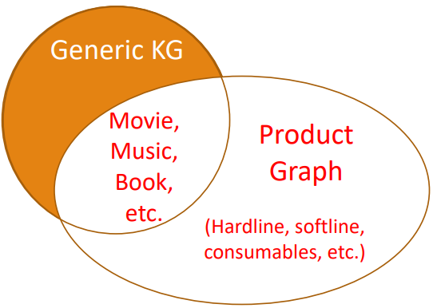
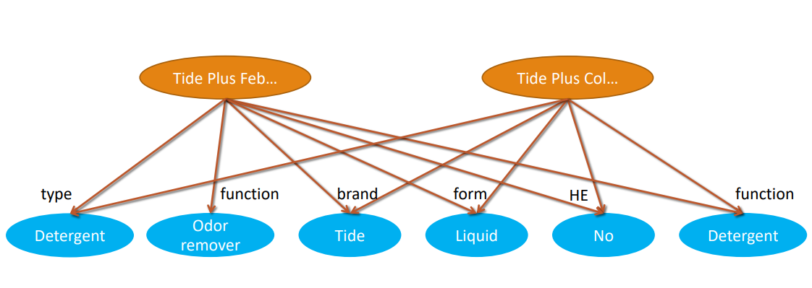
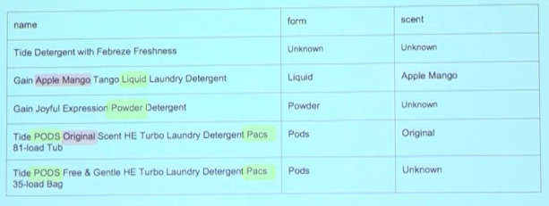
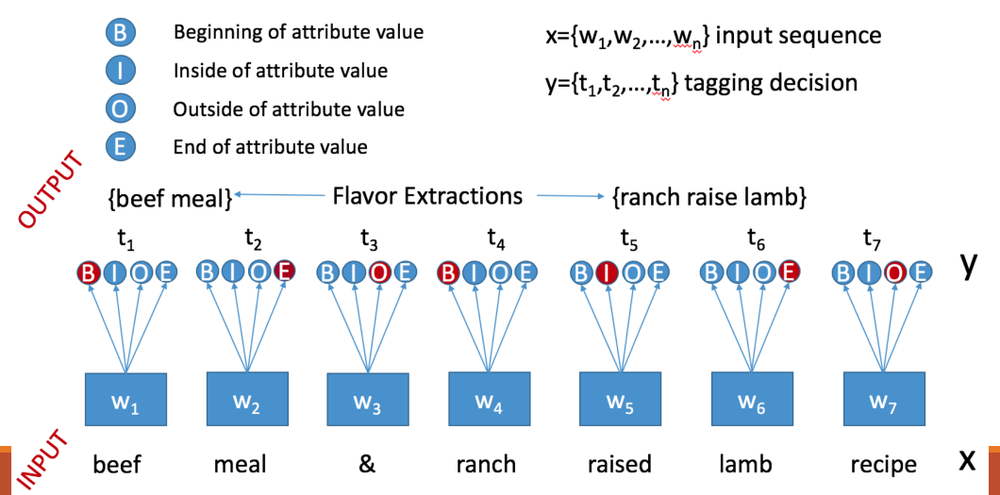
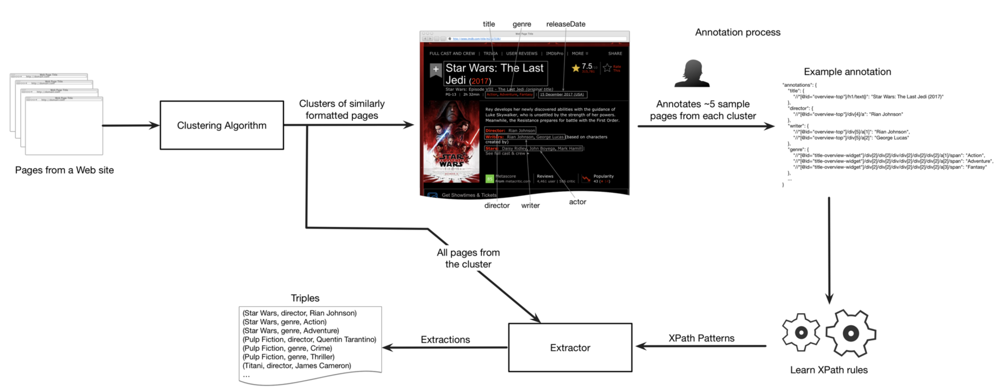
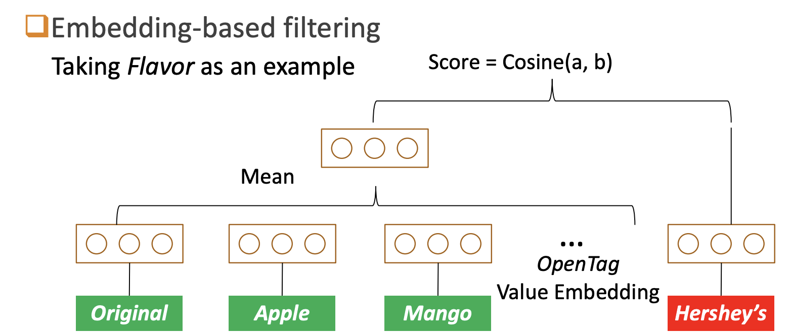
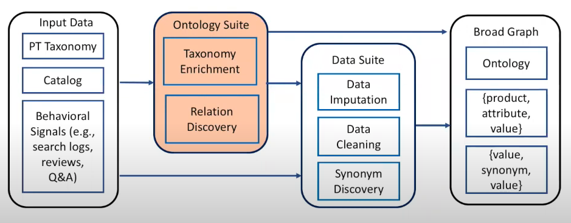

# Amazon Product Graph 

*"structure all of the world's information as it relates to everything available on Amazon"*
	- Xin Luna Dong

## 1. Definition of Product Graph 
- an e-commerce specific form of knowledge graph
- build to improve product findability, interoperability and end-user experiences
- consists of product details, brands, categories, features, images, reviews
- the structured data of each product is linked to other structured information

### Difference Product Graph - Knowledge Graph

| Generic Knowledge Graph |			
|:--------------|						
|consist of Nodes (presenting entities)	& Edges (relationship)|
|a lot of information, which are related to products| 
|used a lot in search & personal assistant (Google, Alexa)|     
 

| Product Graph|			
|:--------------|
Extension of a generic Knowledge Graph
Hardline, Softline, Consumables
these information are not modeled in generic KG

### What is the Amazon product graph about?
**Mission:** To answer any question about products and related knowledge in the world

#### Challenges in Building a Product Graph
building a high coverage knowledge graph for products is more challenging than generic knowledge graphs
- highly specific and complex domain
- billions of products - constantly growing number of products (freshness)
- large number of product categories
- constantly changes of products 
- product information across the internet is largely unstructured (No major sources to curate product knowledge from)
- small amount of training data

### Broad Graph:
- similar to property graph
- entities, which represents property values
- each product is connected to the property value by the edges labeld with the properties

## 3. How a Product Graph (Broad Graph) is build 

#### Step 1

**Ingestigate the Amazon Product Catalog**
- Transforming the data in the amazon product catalog into RDF-format

#### Step 2a

**Extract information from the product profiles**
- Title
- Descriptions
- Bullets

**Problems:**

- No normal sentence structure
- No fixed vocabulary

**Solution: Open Tag Extraction**

A model wich uses entity recognition techniques (BIOE) to extract information about products.

The example in the image shows how the flavour attribute is extracted.

#### Step 2b

**Extracting Knowledge from semi-structured data on the web**

1. Cluster are created with similary formatted web pages

2. Human annotators annotate the x-paths of the needed information

3. The x-path rules are learned by using logistic regression

4. A machine learning algorithm uses these learned x-path rules to extract the information from the web pages and creates triples from them

**Linking Entities**

- After the extraction a classification model called random forest is used to link some entities together and reduce the overall labels

#### Step 3

**Cleaning data**

**Problem :**

- Value noise
    - Invalid brands: "1 lb"
    - Lengthy descriptive brands: "The company X was founded in..."
    - Unnormalized values: "Reese's", "reese", "REESE's"
- Inconsistency
    - E.g., isSugerFree && sugarPerServing > 0

**Solution**

- Applying discriminative models to tell if the value is right or wrong. Example Brand or Not a Brand

- Applying word embeddings to get wrong values

## AutoKnow Framework - Self-driving system for building product knowledge grpahs automatically

### What is the AutoKnow Framework?

- AutoKnow is a cutting-edge system for building knowledge graphs automatically.
- It specializes in creating knowledge graphs for retail products.
- Knowledge graphs help organize and understand complex relationships between different types of data

### How Does AutoKnow Work?

- It begins with existing product categories.
- It uses machine learning to find and label new product types and attributes.
- It analyzes data from product descriptions, reviews, and questions and answers.
- AutoKnow uses embeddings to guess missing information.
- It checks and corrects data to ensure accuracy.
- It identifies and combines synonyms in the product graph.

### Goals of AutoKnow

The primary goals of AutoKnow are:

- Automatically build knowledge graphs for retail products.
- Enhance the accuracy and completeness of product information.
- Improve the user experience by making product data more structured and accessible.

## Amazon's Goals and Use Cases for Product Graphs

### 1. Enhanced Product Recommendations

- Product graphs power Amazon's recommendation engine.
- Analyzing user behavior, purchase history, and product relationships enables personalized product suggestions.

### 2. Improved Search and Discovery

- Product graphs enhance search results and product discoverability.
- Accurate relationships between products enable customers to find what they need more efficiently.

### 3. Content Enrichment

- Product graphs structure and organize product information.
- Rich content like descriptions, images, reviews, and Q&A is presented in an accessible manner.

### 4. Competitive Analysis

- Product graphs help Amazon analyze competitors and their offerings.
- Price optimization, product selection, and strategic decision-making benefit from this data.

### Conclusion

- Amazon's product graphs serve as a versatile tool across its e-commerce ecosystem.
- They play a crucial role in improving customer experience, optimizing operations, and ensuring trustworthiness within its marketplace.

## Sources: 
- https://www.aboutamazon.com/news/innovation-at-amazon/making-search-easier 
- https://lunadong.com/talks/BG.pdf
- https://www.amazon.science/blog/building-product-graphs-automatically
- https://dl.acm.org/doi/10.1145/3219819.3219938
- https://wordlift.io/blog/en/product-knowledge-graph/ 