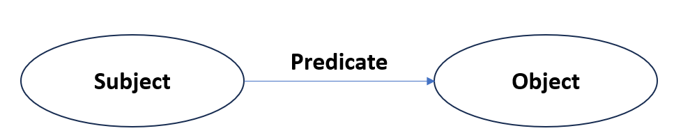

# RDF and Property Graphs Interoperability
## Status and Issues

### Definitions

**RDF Database**
    - RDF defines a data model which is based on the notion of RDF triple (subject, predicate, and object)

    - RDF database (triplestores) systems are designed to support the Resource Description Framework
    - SPARQL is the standard query language to retrieve and manipulate RDF data 
    - and there are languages to describe structure, restrictions and semantics on RDF data (e.g. RDF Schema, OWL)

**Property graph**

- graph database systems are based on the Property Graph (PG) data model
- The notion of schema for a property graph database has not been developed in practice, although some systems use the notions of node types and edge types
- there is no standard query language (although there are several proposals)

**Interoperability** 

- Interoperability: the ability of two or more systems or components to exchange information, and to use the information that has been exchanged

- context of data management
    - interoperability is concerned with the support of applications which exchange and share information across the boundaries of existing databases

- Data and information interoperability is relevant for several reasons:
    -Promotes data exchange and data integration
    - Allows to have a common understanding of the meanings of the data
    - Allows the creation of information and knowledge and their subsequent reuse and sharing 
    - Facilitates the access to a large number of independently created and managed information sources of broad variety
    - Facilitates the reuse of available systems and tools
    - Allows to explore the best features of different approaches and systems
    - Enables a fair comparison of database systems by using benchmarks
    - Supports the success of emergent systems and technologies
    - It is a crucial factor for the development of new information systems
    - One can define several forms of interoperability in information systems

### Issue of RDF and PG Interoperability

- Big challenge to secure interoperability between RDF databases and property graph databases
    - Because of the heterogeneity between RDF and graph database systems
- Paper gives an overview regarding the following points:
    - Syntactic interoperability
    - Semantic interoperability
    - Query interoperability

### Syntactic interoperability

- the main requirement to support syntactic interoperability is the existence of data formats 
    - syntax for encoding data stored in a database over which transformation methods can be implemented
    - RDF: Turtle, TriG, RDF/XML, RDF/JSON and JSON-LD are data formats for encoding RDF data
- In contrast, there is no data format to encode property graphs
    - Given this restriction, some systems use graph data formats (like GraphML, DotML, GEXF, GraphSON), but none of them is able to cover all the features presented by the property graph data model

- Syntactic interoperability focuses on data exchange at the level of serialization formats
- Syntactic interoperability refers to the support of a standard data format for encoding property graphs, as there is currently no standard format

### Syntactic interoparbility approach(es)

- Hartig proposes two transformations between RDF* and property graphs.
    - RDF* is a syntactic extension of RDF which is based on reification 

**The shortcoming of this approach is that RDF* isn't supported by majority of RDF triplestores**

### Syntactic interoperability summary 

- There are several approaches
    - Some of the current methods are based on reification / Transfer RDF to RDF*
    - RDF reification leads to an explosion in the size of the resulting graph
    - Other methods does not address blank nodes or RDF entailment
- There is no standard data format for encoding property graphs
- The most RDF serializations are triple-centric, while the most PG serializations represent graph as lists of nodes and edges
- Despite the serialization is based on JSON or XML in both models, the syntaxes used are difficult to map

**there is not study about the subsequent transformation from RFD to property graphs**

### Semantic interoperability

- Semantic interoperability focuses on ensuring a common understanding of the meanings of the data exchanged between RDF and property graph databases
    - source and target systems understand the meaning of the data that is exchanged

- Additionally, semantic interoperability implies that applications can understand the meaning of representations and thus can setup automatically mappings between different representations by content analysis

### Semantic interoperability approach
- common approach to support semantic interoperability is the definition of data and schema transformation methods
- The schema transformation method takes as input the schema of the source database, and generates a schema for the target database
- The transformation methods can be implemented by using data formats or data definition languages 

**there is no method that support data and schema transformations between RDF and PGs**

### Semantic interoperability summary 

- An RDF database could contain semantic information that allows data inference (i.e. to infer new triples based on the existing triples)
    - Current graph database systems have been not designed to support inference
- RDF databases contain a mix of data and schema
    - it is necessary to decide whether to extract the schema (and transforming it independently), or processing the schema as part of the data
- Discovering semantic information and resolving mismatches requires the application of human intelligence and judgment

**the semantic interoperability is determined by the power of the translation methods to support data and semantics interpretation**

### Query Interoperability

- Query interoperability deals with translating queries between SPARQL and property graph query languages
- Query language for RDF databases  = SPARQL
- Query language for property graphs = not defined

**This has led to the development of a wide range of vendor-specific graph query languages (e.g. Cypher for Neo4j and Gremlin for Apache TinkerPop)**

### Query interoparbility summary

- Most of the current property graph query languages do not have a solid formal foundation (semantics, complexity and expressiveness)
- This raises a critical challenge for supporting query interoperability, since a formal mapping between SPARQL and a property graph language cannot be defined

### Conclusion

- The paper highlights the importance of interoperability in database systems 
- the research on the area must be supported by the development of successful standards (starting with the standardization of the property graph data model and its query language)

**Approaches exist, but Literature is still restricted
The interoperability basically fails because of missing standards of property graph databases**

### Outlook

- Property graph databases
    - A recent publication, called the GQL manifest, proposes to define and standardize one property graph query language by fuzing the best of three query languages: Cypher, PGQL and G-CORE

### Sources
- https://ceur-ws.org/Vol-2369/paper01.pdf
- https://nextweb.gnoss.com/recurso/what-are-the-differences-between-a-graph-database/
- https://neo4j.com/graphgists/graph-databases-rdf-and-linked-data/
- https://www.semanticscholar.org/paper/The-Property-Graph-Database-Model-Angles/91d6e8ba5dd90b02fe3bd870b19da13a6167af53#citing-papers
