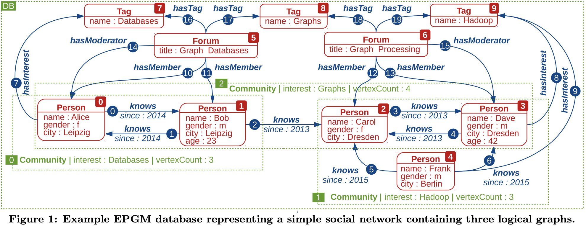
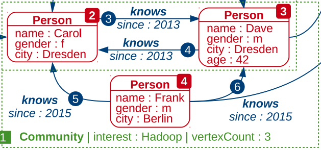
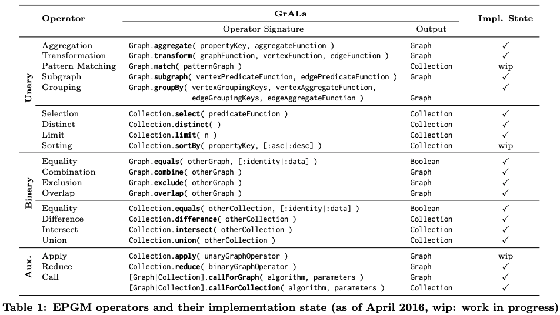
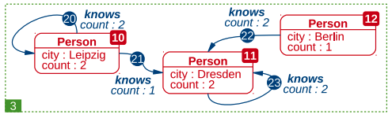
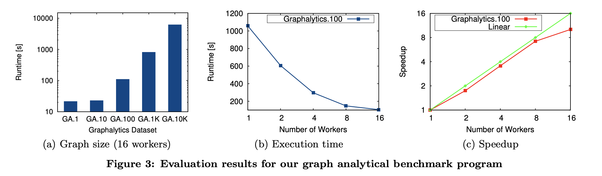

# Analyzing Extended Property Graphs with Apache Flink

## Why is an Extended Property Graph Needed? (Problem)

- Conventional graph data models are limited in their analytics capabilities. They are able to run a single algorithm to get some basic analytics about the graph but struggles when the analyses is more complex and require multiple algorithms.

- Conventional graph data models are barely able to represent a single graph as well as graph collections inside that graph

- Conventional graph structures struggle with the various attributes and relationships in real graphs, which makes it difficult to execute multi-layered algorithms.

## Requirements for an Extended Property Graph

The identified requirements for an effective graph data model are as follows:

1. **Representation Flexibility**: Ability to represent single graphs as well as graph collections.

2. **Support for Heterogeneous Attributes**: The model should handle diverse attributes without a fixed schema for vertices, edges, and graphs.

3. **General-Purpose Operators and Use-Case Specific Algorithms**: It should offer general operators (e.g., selection by vertex count) and support specific algorithms for use cases (e.g., community detection).

4. **Combination of Operators and Algorithms**: Allow the combination of multiple operators and algorithms to create analytical programs.


## Extended Property Graph Model



- The Extend Property Graph Model is a single graph wich includes **graph collections**
- **Graph collections** are a natural way to represent logical partitions of a graph

**Example**
- Single Graph: Social Network
	- Graph Collections: Communities inside the social network


### Graph representations

- The Graph is composed of a set of **vertices** and **edges**
	- **Vertices represent objects** like persons, forums, interested tags
	- **Edges describes the relationships** between vertices

- Each logical graph (graph collection) has a dedicated set of vertices and edges
- Vertices and edges can overlap in two or more logical graphs

- **Graphs, Vertices and Edges** are described by
	- Type labels (e.g. Person)
	- Properties ( e.g. name: Alice)
		- Properties are Key-Value pairs
	- Vertices with the same type can have different properties: **schema-free and heterogeneous**




## Operators

- To do some graph analytics on the the EPGM the research Team developed some Operators.

- The Operators can then be called in the domain specific language **GrALa (Graph Analytical Language)**

- In general the operators can be divided into the following categories:
	- **Unary**
		- Takes a single graph/collection as input
	- **Binary**
		- Takes two graphs/collections as input
	
- Unary and binary operators are further **divided into Graph operators and Collection operators**



### Unary operator

**Example: Grouping**

``` GrALa
outGraph = db . G 
	. subgraph ( 
	( v = > v . label == ’ Person ’) , 
	( e = > e . label == ’ knows ’)) 
	. groupBy ( 
	[: label , ’ city ’] , 
	( superVertex , vertices = > 
			superVertex [ ’ count ’] = vertices . count ()) , 
	[: label ] ,
	( superEdge , edges = > 
			superEdge [ ’ count ’] = edges . count ()))
```

- **Goal**:
  - Group persons in the graph by the city they live in and calculate the number of group members.
  - Group edges between users living in different cities and those living in the same city.

- **Steps**:
  - Use the subgraph operator to gather all persons and their mutual relationships as the input graph for grouping.
  - Define vertex grouping keys based on type label and the property key "city."
  - Group edges based only on their type label.
  - Define vertex and edge aggregate functions to count group members, receiving the super entity and the set of group members as input.
  - Both functions use the count() aggregate function for calculation.

**Result**



## Binary operator

**Example: Combine**

``` GrALa
db.G[0].combine(db.G[2])
```

- **Goal**:
  - Combine two graphs to create a new graph

- **Steps**:
  - Call the operator on one graph
  - Provide the second graph as a input to the combine operator


### Collection operators

- Collection operators takes a graph collection as their input!

**Example: Select**

```
inCollection = < db . G [0] , db . G [1] , db . G [2] >
phi = ( g = > g [ ’ vertexCount ’] > 3) 
outCollection = inCollection . select ( phi )
```

- **Goal**:
  - To filter a collection of three logical graphs based on a user-defined predicate function evaluating the vertexCount property greater than 3.

- **Steps**:
  - Apply the operator to the collection of three logical graphs.
  - Use a user-defined predicate function, phi, to assess if the input graph's vertexCount property value is greater than 3.

- **Result**:
  - When applied to the database shown in Figure 1, the resulting collection only contains db.G[2].

### Auxiliary Operators

- Essential for advanced graph analytics beyond standard graph and collection operators.
- Facilitate integration of application-specific graph mining algorithms.
- Support extraction of subgraphs beyond pattern matching, like community detection in social networks.

- **Types of Auxiliary Operators**:
  - **callForGraph Operators**: Yield single graph results.
  - **callForCollection Operators**: Produce graph collections as output.

- **Function**:
  - Execute unary graph operators across multiple graphs, enabling tasks such as computing aggregated values for entire collections.

``` GrALa

outCollection = inCollection.apply(g => g.aggregate('edgeCount', (h => h.E.count())))
```

## Experiment

**The goal of the experiment is to show the scalability of the EPGM implementation on top of Apache Flink by running a analytical program to the EPGM**

### Apache Flink

  - Apache Flink is a framework and distributed processing engine for stateful computations over unbounded and bounded data streams. Flink has been designed to run in all common cluster environments, perform computations at in-memory speed and at any scale.
  - Supports declarative definition and execution of analytical programs for both streaming and batch data using data sets and transformations.
  - Includes various transformations such as map, reduce, and relational database-like operations (e.g., join, group-by).

### Implementation

#### Graph representation

- The EPGM is implemented in Apache Flink by using three object types
	- graph head
	- vertex
	- edge

```
GraphHead := <Id , Label , Properties >
Vertex := <Id , Label , Properties , GraphIds >
Edge := < Id , Label , SrcId , TrgtId , Properties , GraphIds >
```

- The implementation code looks like this:
```
LogicalGraph g0 = {
	DataSet < GraphHead > graphHead = {
	 <0 , ’ Community ’ ,{ ’ interest ’: ’ Databases ’ ,...} >
	} ,
	DataSet < Vertex > vertices = {
	<0 , ’ Person ’ ,{ ’ name ’: ’ Alice ’ ,...} ,{0 ,2} > , 
	<1 , ’ Person ’ ,{ ’ name ’: ’ Bob ’ ,...} ,{0 ,2} > 
	} , 
	DataSet < Edge > edges = {
	<0 , ’ knows ’ ,0 ,1 ,{ ’ since ’:2014} ,{0 ,2} > , 
	<1 , ’ knows ’ ,1 ,0 ,{ ’ since ’:2014} ,{0 ,2} > } 
	}
```

- This code shows the implementation of G0 in figure 1

#### Operators

**GrALa Implementation:** 
- Developed using Java, each EPGM operator is translated into a series of Flink transformations on specific datasets.

**Selection Operator Implementation:** 
- Application of the filter transformation to apply user-defined predicates on the graph head dataset of the input collection. 
- Extraction of identifiers of filtered graph heads to filter vertices and edges based on graph membership. 
- Creation of a new graph collection from the filtered graph heads, vertices, and edges.

``` Java

1. DataSet<GraphHead> outGHeads = coll.getGraphHeads().filter(predicateFunction);
2. DataSet<Id> graphIds = outGHeads.map(ID_ONLY);`
3. DataSet<Vertex> outV = coll.getVertices().filter(IN_ANY_GRAPH_FILTER).withBroadcastSet(graphIds);
4. DataSet<Edge> outE = coll.getEdges().filter(IN_ANY_GRAPH_FILTER).withBroadcastSet(graphIds);
5. return new GraphCollection(outGHeads, outV, outE);

```

#### Experimental Overview

- **Experimental Setup:**
  - **Cluster configuration:** 16 worker nodes with specific hardware specifications (CPU, RAM, disks), running openSUSE 13.2, connected via 1 Gigabit Ethernet.
  - **Dataset:** Heterogeneous social network graphs with up to 11 millions edges.

- **Benchmark Program Overview:**

``` GrALa 
1. `outGraph = socialNetworkGraph`
2. `.subgraph(`
3. `(v => v.label == 'Person'),`
4. `(e => e.label == 'knows')`
5. `)`
6. `.transform(`
7. `(gIn, gOut => gOut = gIn),`
8. `(vIn, vOut => {`
9. `vOut.label = vIn.label`
10. `vOut['city'] = vIn['city']`
11. `vOut['gender'] = vIn['gender']`
12. `vOut['k'] = vIn['birthday']`
13. `}),`
14. `(eIn, eOut => eOut.label = eIn.label)`
15. `)`
16. `.callForCollection(:LabelPropagation, ['k', 4])`
17. `.apply(g => g.aggregate('vertexCount', (h => h.V.count())))`
18. `.select(g => g['vertexCount'] > 50000)`
19. `.reduce(g, h => g.combine(h))`
20. `.groupBy(`
21. `['city', 'gender'], (superVertex, vertices => superVertex['count'] = vertices.count()),`
22. `[], (superEdge, edges => superEdge['count'] = edges.count())`
23. `)`
24. `.aggregate('vertexCount', (g => g.V.count()))`
25. `.aggregate('edgeCount', (g => g.E.count()))`
```
  
  - Input: Entire social network represented as a single logical graph.
  - Graph transformation process:
    - Extraction of a subgraph containing only persons and their relationships.
    - Transformation to a representation with necessary information for subsequent operators.
    - Utilization of a community detection algorithm from Flink Gelly.
    - Application of the algorithm on the graph, resulting in a graph collection containing found communities.
    - Application of aggregate and selection operators to filter communities based on vertex count thresholds.
    - Combination of filtered communities into a single logical graph using the reduce operator.
    - Grouping the combined graph by vertex properties (city and gender) and incident vertices.
    - Analysis through groupwise counting to understand super entities' representation in the graph.
- **It filters, transforms, analyzes, and aggregates a social network graph based on person-to-person relationships and properties.**

**Experiment Execution and Results:**


  
**Experiment 1 - Scaling Graph Size at Fixed Workers:**
  - Demonstrated near-linear execution time scaling from smaller (GA.10) to larger graphs (GA.10K).
  - Smaller graphs didn't significantly reduce execution times due to fixed job initialization time.
  - Figure 3(a)

**Experiment 2 - Fixed Graph Size with Increasing Workers:**
  - Execution times ranged from 1.057 seconds on a single worker to 104 seconds on 16 workers for a fixed graph size (GA.100).
	  - Figure 3(b)
  - Speedup analysis showed nearly linear speedup for up to 8 workers and a slight decrease for 16 workers.
	  - Figure 3(c)

**Execution Time Analysis:**
  - Identified communication between workers, primarily due to join and group-by transformations, as the largest contributor to execution time.
  - Join and group-by transformations caused increased network traffic as workers exchanged data, while operations like map and filter could be executed independently by single workers.
  - Flink's optimizer aimed to reduce data exchange between workers through reordering transformations.

### Conclusion

- **EPGM Model Introduction:**
  - Introduced a flexible graph data model supporting versatile, combinable operators for varied graph types and collections.

- **Preliminary Experiment Insights:**
  - Revealed benefits from leveraging the underlying distributed computing framework, showcasing the model's functionality and extensibility.

- **Future Focus:**
  - Outlined future goals encompassing graph pattern matching, optimization, memory efficiency, and enhancements through graph partitioning for continued development.


## Source

- https://dbs.uni-leipzig.de/files/research/publications/2016-7/pdf/EPGM.pdf
