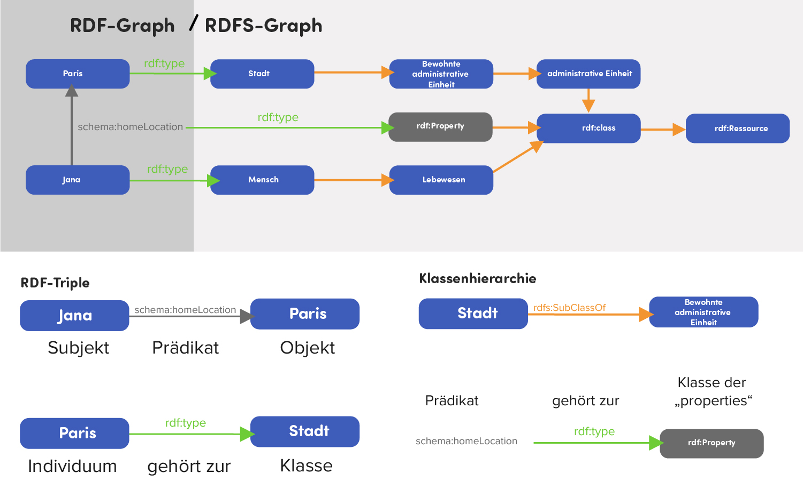

# Resource Description Framework Schema (RDFS)

## Extension of Resource Description Framework (RDF)

- RDF provides a universal way to encode factual data on the web

- Desirable
    - Statements about generic sets of individuals (classes), e.g. organizations
    - Specification of the logical Relationships between individuals

    ```
    
    ```

## RDF Schema

- For interpretation, it needs a common vocabulary (also called ontology)
- RDFS gives the vocabulary
- Concept for the description of classes, resources and properties as well as their interrelationships
- Can be interpreted by computers with RDFS-Support

## Terminology

- Classes
    - Resources: Major Class - everything in RDFS is a resource
        - Analogy to OOP, in Python everything is an object
    - Classes: Declares a resource, typically in combination with rdfs:type (triple)
    - Literal: Such as strings and integers
    - Property: Base Class for Properties
- Properties
    - Domain: Declares the class of the subject in a triple
    - Range: Declares the class or datatype of the object in a triple
        - ex:Student rdfs:domain ex:Person
        - ex:Student rdfs:range ex:University
        - “Finn studiesAt THKöln” — Finn is Person, THKöln is University
    - Type: State that a resource is an instance of a class
    - subClassOf: Definition of classes inheritance hierarchies
        - ex:TextBook rdfs:subClassOf Book
    - subPropertyOf: Definition of property inheritance hierarchies
        - ex:happilyMarried rdfs:subPropertyOf ex:married
        - ex:Markus rdfs:happilyMarried ex:Anja
        - ex:Markus rdfs:married ex:Anja, yield True
    
    ## Example
    
    ```
    
    ```