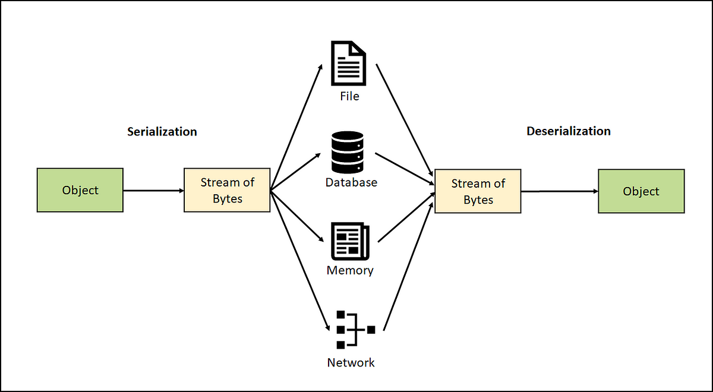
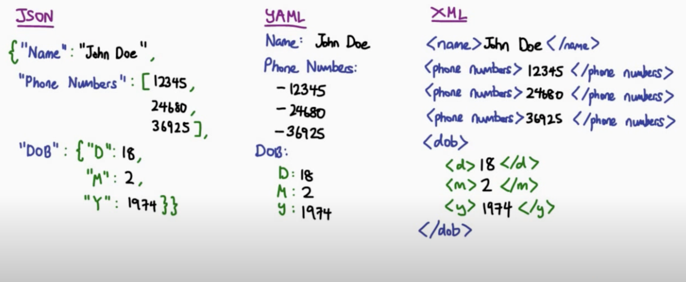
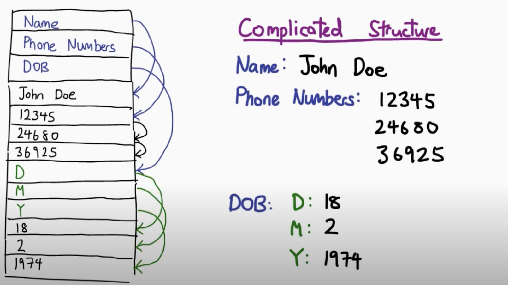
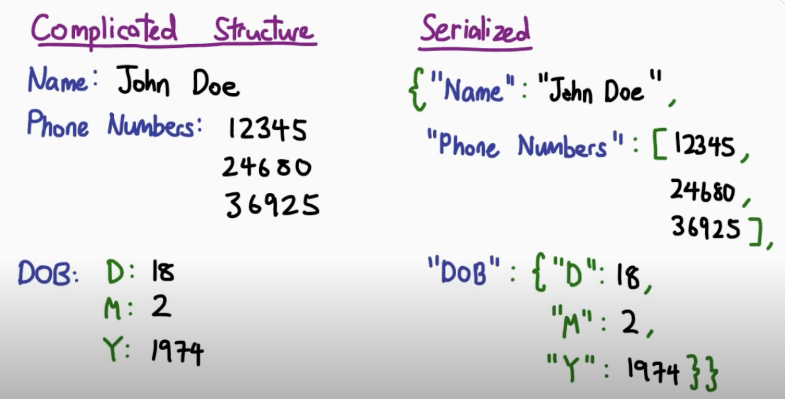

# Serialization - Tobias Jennert

## Problem

- Computer systems **vary** in their hardware architecture, operating systems, and internal binary data representations.
- Data and data structures are usually stored as binary data representations in the memory of a machine.
- To exchange data between different systems, a **platform- and language-neutral data format** is required.
- To send this data to another services or machine this data needs to be **translated into a information that can be send over a connection**.

## Serialization

Serialization is a process in computer science and data management that involves converting complex data structures, objects, or values into a format that can be easily **stored, transmitted, or reconstructed** later. It is particularly important in the context of data storage, communication between different systems, and the persistence of program states. Serialization addresses the need to represent data in a way that can be saved to disk, sent over a network, or stored in a database and later reconstructed accurately.

- The process of converting data structures etc. into a format that can be transmitted or stored is called **serialization**.
- The process of reconstructing the data structure/object from the serialized format is called **deserialization**.

### Serialization Formats
    
- **Binary-based format**: Java Object Serialization, Protocol Buffers, and MessagePack, BSON (Binary JSON).
- **Text-based formats**: JSON, XML, YAML.

### Comparison 

- **Speed**: Binary formats are faster than text-based formats.
- **Data size**: Binary formats occupy less space than text-based formats, particularly with larger files. 
- **Usability**: Text formats like JSON, YML, XML are human-readable.

## Use Cases

1. **Data Persistence:** Serialization allows you to save the state of an object or data structure to a file or database. This is crucial for applications that need to store and retrieve data between program executions. 
	- **Example**: A word processing application can use serialization to save and load documents.
    
2. **Data Transmission:** When data needs to be transmitted between different systems or over a network, serialization is used to convert the data into a format that can be easily sent and reconstructed at the receiving end. This is important for protocols like HTTP, where data is exchanged between web servers and clients.
	- **Example**: Client-Server Communication
    
3. **Cross-Platform Compatibility:** Different programming languages and systems may have different data structures and representations. Serialization provides a standardized way to represent data, making it easier to share information between systems running on different platforms.
    
4. **Object Persistence:** In object-oriented programming, serialization allows objects to be saved and loaded, preserving their internal state. 
	- **Example**: This is especially useful when when implementing undo/redo functionality in applications.
    
5. **Caching:** Serialization is often used in caching mechanisms, such as in-memory data stores, to serialize complex data structures and store them in a more efficient format. This helps improve data retrieval performance.
    
6. **Versioning:** Serialization can handle versioning of data. When data structures change over time due to software updates, serialization allows for backward and forward compatibility, ensuring that older serialized data can still be deserialized with newer versions of the software.
    
7. **Data Science and Analytics:** In data science and analytics, serialization can be used to save and share datasets and machine learning models for reproducibility and collaboration.

## Example of serialization

**The data structure in a program or application is stored in the machines memory**

**To send this data over a network the data needs to be translated into a string representation. This is done by converting or serializing the data object into a string representation. In this case the format of the string representation is called JSON.**

    
## Summary

In summary, serialization solves the problem of efficiently representing and transferring data, objects, and complex data structures in various scenarios, such as data storage, network communication, and cross-platform compatibility. It plays a fundamental role in modern software development and data management.

### Source
- https://devopedia.org/data-serialization#Paul-2017
- https://www.freecodecamp.org/news/what-is-serialization/
- https://www.youtube.com/watch?v=uS37TujnLRw&list=LL&index=1
- https://krishankantsinghal.medium.com/serialization-and-deserialization-5046c958c317