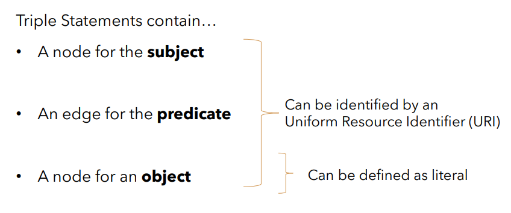
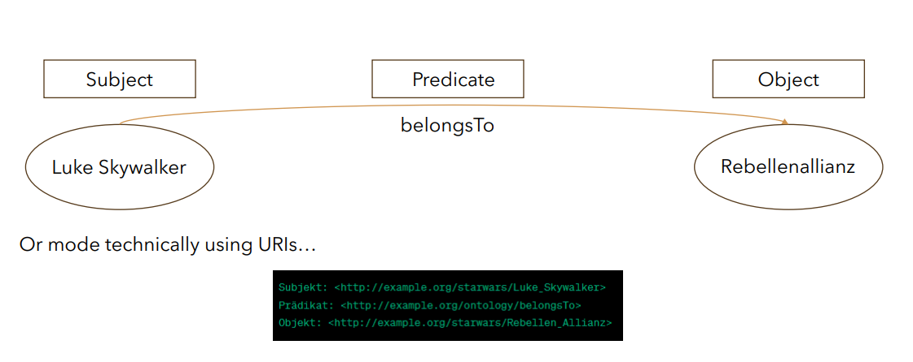

# The Resource Description Framework (RDF)

2023-10-30, Andreas Kruff

## TOC

1. Problem of World Wide Web
2. Semantic Web
3. Basics about RDF
4. Summary

## Problem of World Wide Web

- Most of the Data in the World Wide Web consists of unstructured data

- Problem:
    - Informations are not machine-readable
    - Syntax and relations between informations are not machine readable
- More structured data would allow for improvements in
  - Search Results
  - Knowledge Representation
  - ...
- Structured data would also simplify interoperability between systems

## Solution: RDF and Semantic Web

Quote by Tim Berners-Lee

“The Semantic Web is not a separate Web but an extension of the current one, in
which information is given ** well-defined meaning, better enabling computers
and people to work in cooperation.**”

- RDF is a **data model** for metadata
- „RDF allows to state anything about anything” (Dominique Hazael-Massieux)
- Recommended by the World Wide Web Consortium (W3C) in 1999
− RDF 1.0 was released in 2004
- Method for description and exchange of graph data
− Directed graph composed of triple statements

### Triple Statements

 
 

Nodes can be defined as
- Resources (e.g. URIs & IRIs)
- Blank Nodes (bnodes) / Anonymous Resources

 

- Literals
    - Integers, Strings, Boolean

## General RDF Framework

 

## URI / IRI

- Serves as string to uniquely identifying resources on the web
- Allows and enables the **network effect** of the Semantic Web
- URIs can be separated into...
    - URLs that identify and locate resources in the web
    - URNs – Globally unique names for the resources without location
- Limited to ASCII

 

 

Alternative Option: IRIs (Internationalized Resource Identifier)

- Similar concept like URIs but allowing for special characters

## Popular syntaxes for Serialization of RDF
# RDFa
 
# RDF/XML
 
# JSON-LD
 
# Turtle
 

## Ontologies / Vocabularies

- Creating ontologies/vocabularies & schemas in the semantic web
- Popular ontologies are RDFS / OWL / schema.org

Ontology Definition by Tom Gruber:

“In the context of computer and information sciences, an ** ontology defines a set of representational
primitives **with which to model a domain of knowledge or discourse. The representational ** primitives
are typically classes **(or sets), ** attributes **(or properties), and ** relationships ** (or relations among class
members). The definitions of the representational primitives ** include information about their meaning
and constraints on their logically consistent application.**“

- Ontologies like RDFS and OWL can be combined

Additional Metadata-Schemas for Ressources in the Web

- Usage of Dublin Core & FOAF

 

## Improving Quality of RDF by RIF (Rule Interchange Format)

- Compatible with OWL & RDF
- Includes multiple dialects
    - RIF-Core
    - Basic Logic Dialect (BLD)
    - Production Rule Dialect (PRD)
- Benefits
    - Consistency Checking
    - Better (automized) Data Integration

## Summary

RDF is still State of the Art for implementing the Semantic Web

- Key Ideas:
    -  Assigning machine-readable relations between entitites
    - The usage of URIs/IRIs allow linkage of clearly defined entities
    - Improvement of interoperability

## Sources

1. Azad, Poupak & Navimipour, Nima & Rahmani, Amir & Sharifi, Arash. (2020). The role of structured and unstructured data
managing mechanisms in the Internet of things. Cluster Computing. 23. 1-14. 10.1007/s10586-019-02986-2.
2. Valkonen, Harri. (2020). An Ontology-Based Configuration Management Model for Network Devices.
3. Berners-Lee, Tim & Hendler, James & Lassila, Ora. (2001). The Semantic Web: A New Form of Web Content That is Meaningful
to Computers Will Unleash a Revolution of New Possibilities. ScientificAmerican.com.
4. Gruber, T. (2009). Ontology. In: LIU, L., ÖZSU, M.T. (eds) Encyclopedia of Database Systems. Springer, Boston, MA.
https://doi.org/10.1007/978-0-387-39940-9_1318
5. https://www.w3.org/2003/Talks/semtour-athens-rdfapp/slide5-0.html
6. https://files.stample.co/browserUpload/74649d61-f5bf-4eec-8464-2dc58be21241
7. https://medium.com/@alapati887/unlocking-the-semantic-web-the-power-of-rdf-and-linked-data-307f2cfe1c01